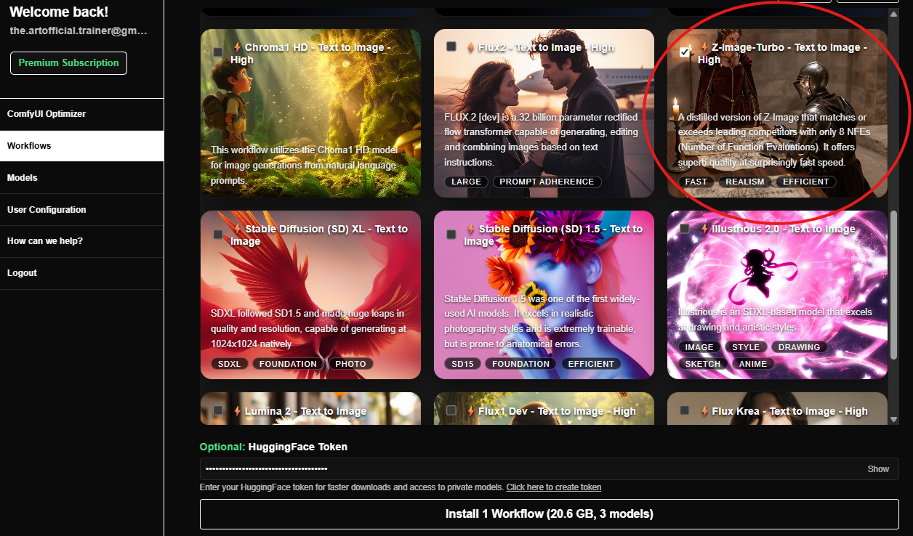
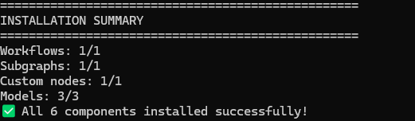
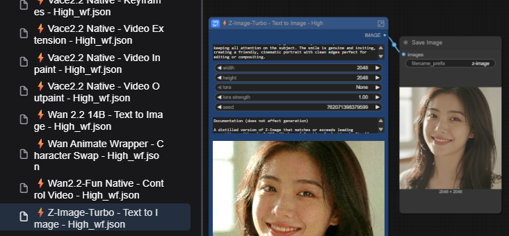
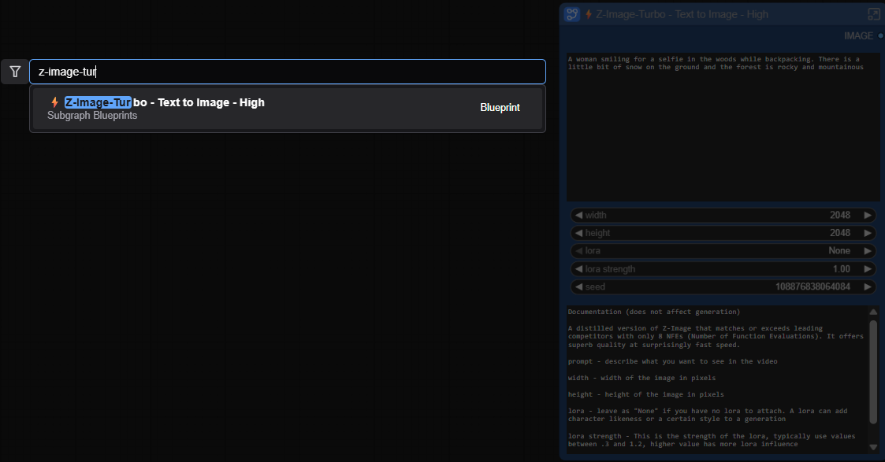

[](https://nuvulabs.ai)

# Nuvu - Private AI Generation for ComfyUI

> **Usage License:** [Nuvu Labs](https://nuvulabs.ai) grants you a limited license to run the Nuvu plugin inside ComfyUI for its intended functionality in commercial or non-commercial workflows. Any other commercial use—including copying, modifying, sublicensing, or redistributing this code or derivative works—requires prior written consent from Nuvu Labs.

### **[Nuvu](https://nuvulabs.ai) makes private AI generation in ComfyUI effortless — built for film and VFX artists who demand privacy, polish, and more time to create. A plug-in right in ComfyUI, which makes the newest, professional-level, workflows a click away.**

## About Nuvu Labs

[Nuvu Labs](https://nuvulabs.ai) is an agency that excels at implementing, scaling, and finetuning AI pipelines in the film and VFX industries. We focus on security and data because your content is your backbone, and uploading your content to any cloud AI service risks your content becoming training material in the future.

## Quick Links to Official Documentation

For complete guides, tutorials, and feature documentation, visit our documentation site (external): **[docs.nuvulabs.ai](https://docs.nuvulabs.ai)**

- [The Nuvu Advantage](https://docs.nuvulabs.ai/the-nuvu-advantage)
- [Installing Nuvu](https://docs.nuvulabs.ai/installation)
- [Create an Account](https://docs.nuvulabs.ai/account/create-account)
- [Subscribe to Premium](https://docs.nuvulabs.ai/account/subscribe)
- [All Features](https://docs.nuvulabs.ai/features)
- [Getting Support](https://docs.nuvulabs.ai/support)

## The Nuvu Advantage

The Nuvu Plug-in for ComfyUI gives you instant access to premium workflows specifically designed for production pipelines. The Nuvu difference is when you download a workflow, you get everything needed to run the workflow. No more searching for obscure custom nodes or models. On top of that, the workflows are condensed into easy-to-use subgraphs that can be searched just like any node. Let's walk through an example.

Let's install Z-Image-Turbo


After clicking Install, all workflows, subgraphs, custom nodes, and models for running Z-Image-Turbo will install.


Now let's restart ComfyUI, and check out what was installed for us!

This is the workflow that was downloaded. It contains a Z-Image-Turbo subgraph with documentation for what all of the inputs and outputs of the subgraph do. The models were already installed, so just click "Run" and as long as you have the VRAM to run the workflow, it will run immediately.



Here is the searchable subgraph. Search for it as you would any other node, and connect it into your favorite image-to-video workflow or anywhere else you'd like.


[Nuvu](https://nuvulabs.ai) has created an extremely efficient pipeline for getting workflows into your hands quickly, so when a new model is released, Nuvu is committed to delivering the capability to you quickly and seamlessly.

## Installing Nuvu

[Nuvu Labs](https://nuvulabs.ai) offers a variety of ways to install the Nuvu Plug-in into ComfyUI for optimal convenience. For detailed installation guides with screenshots, visit [docs.nuvulabs.ai/installation](https://docs.nuvulabs.ai/installation).

### Auto-Installers

Download the applicable script for your system from the [Nuvu releases page](https://github.com/Nuvulabs/ComfyUI-Nuvu/releases).

#### Windows Install

1. Install git through the instructions found on the GitHub website: [GitHub Git install instructions](https://github.com/git-guides/install-git)
2. Place the `.bat` file in the folder where you want to install ComfyUI-Nuvu
3. Double-click the `.bat` file to start installation
4. Inside the ComfyUI folder, double-click `run_comfy.bat` to launch
5. Navigate to [http://localhost:8188](http://localhost:8188) in your browser

[Full Windows installation guide](https://docs.nuvulabs.ai/installation/windows)

#### Linux Install

1. Place the `.sh` file in the folder where you want to install ComfyUI-Nuvu
2. Open a terminal and run: `./linux_install_nuvu_comfy.sh`
3. Inside the ComfyUI folder, run `run_comfy.sh` to launch
4. Navigate to [http://localhost:8188](http://localhost:8188) in your browser

[Full Linux installation guide](https://docs.nuvulabs.ai/installation/linux)

### Comfy Manager

If you already have ComfyUI installed:

1. Install and open [ComfyUI-Manager](https://github.com/Comfy-Org/ComfyUI-Manager)
2. Search for "Nuvu" and click **Install**
3. Click **Restart** after installation completes
4. Refresh your browser — you should see the Nuvu button in your toolbar

[Full Comfy Manager installation guide](https://docs.nuvulabs.ai/installation/comfy-manager)

### RunPod Template

Deploy ComfyUI with Nuvu in the cloud instantly:

1. Sign up for RunPod: [https://runpod.io?ref=ffbuz4zw](https://runpod.io?ref=ffbuz4zw)
2. Deploy the Nuvu template: [Deploy on RunPod](https://console.runpod.io/deploy?template=0lhzij38ow&ref=ffbuz4zw)
3. Set up network storage (500GB+ recommended)
4. Select CUDA 12.8 or 12.9 and your preferred GPU
5. Click **Deploy On-Demand**

[Full RunPod installation guide](https://docs.nuvulabs.ai/installation/runpod)

### Docker

```bash
docker run -d \
  --name comfy-nuvu \
  --gpus all \
  -p 8188:8188 \
  -p 8888:8888 \
  -v /path/to/workspace:/workspace \
  docker.io/nuvulabs/comfyui-nuvu:latest
```

[Full Docker installation guide](https://docs.nuvulabs.ai/installation/docker)

## Next Steps

After installing Nuvu:

1. **[Create an Account](https://docs.nuvulabs.ai/account/create-account)** — Sign up for free
2. **[Subscribe to Premium](https://docs.nuvulabs.ai/account/subscribe)** — Unlock 100+ workflows
3. **[Explore Features](https://docs.nuvulabs.ai/features)** — Workflow Installer, Subgraphs, Model Installer, and more

## Support

- **[Documentation](https://docs.nuvulabs.ai)** — Complete guides and tutorials
- **[Getting Support](https://docs.nuvulabs.ai/support)** — Contact our team
- **[How Can We Help?](https://docs.nuvulabs.ai/support/how-can-we-help)** — Professional services and consulting
- **[GitHub Issues](https://github.com/nuvulabs/ComfyUI-nuvu/issues)** — Report bugs
- **[Discord](https://discord.gg/vdW97AtTAu)** — Community support
